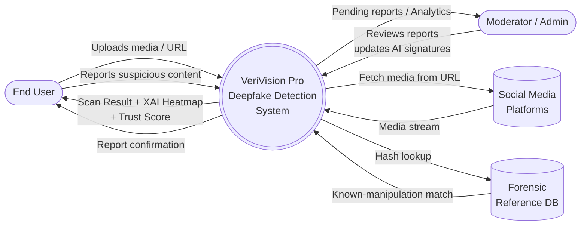
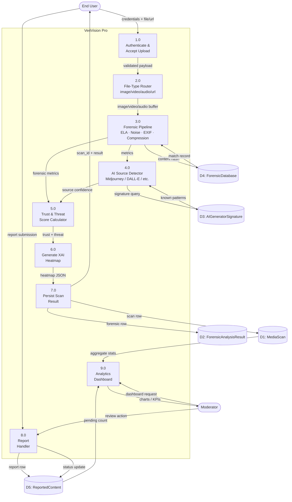
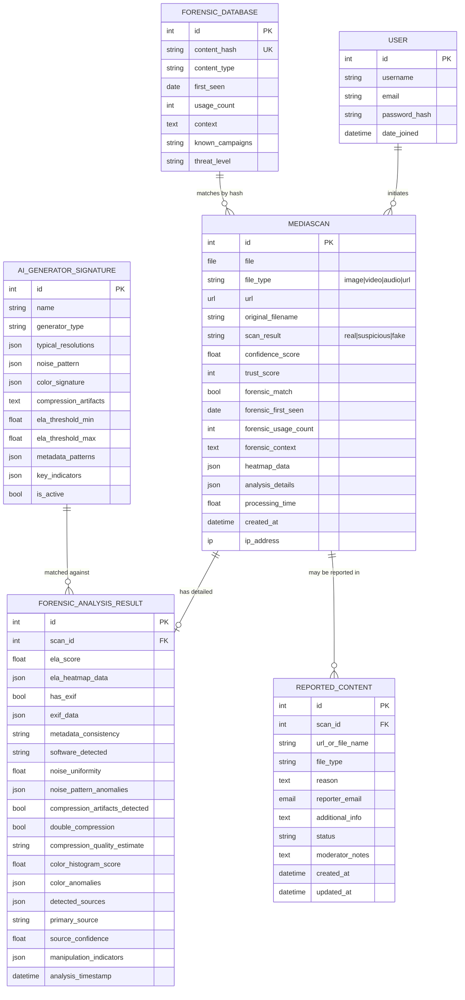
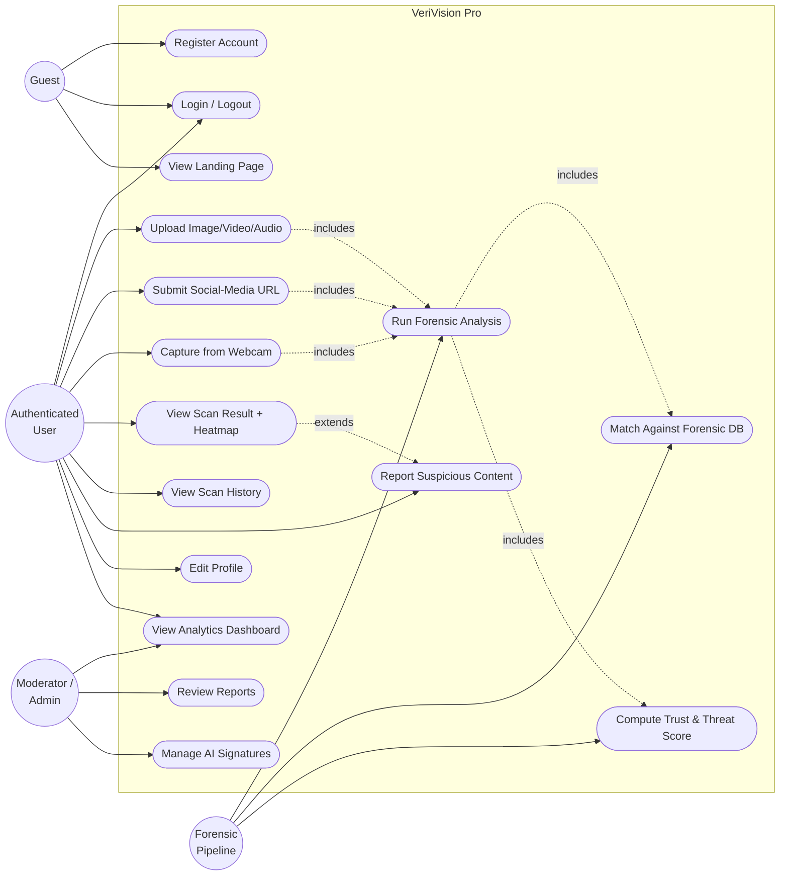

# VeriVision Pro — System Diagrams

Project: AI-powered deepfake & manipulated-media detection platform (Django)
Modalities supported: Image, Video, Audio, Social-Media URL

All diagrams below use **Mermaid** syntax. They render natively in GitHub, VS Code (with the Mermaid preview extension), and most modern Markdown viewers.

---

## 1. Data Flow Diagram — Level 0 (Context Diagram)

Shows the system as a single process and the external entities that interact with it.



---

## 2. Data Flow Diagram — Level 1

Expands the single process into the main sub-processes (upload, forensic pipeline, source detection, persistence, reporting, analytics).



---

## 3. Entity Relationship Diagram (ERD)

Reflects the Django models in [core/models.py](core/models.py).



---

## 4. Class Diagram

Captures the analyzer hierarchy plus the core domain models. Mirrors [core/analyzers/](core/analyzers/) and [core/models.py](core/models.py).

```mermaid
classDiagram
    class BaseAnalyzer {
        <<abstract>>
        +str name
        +analyze(file_path) dict
        +preprocess(file_path)
        +calculate_confidence(metrics) float
    }

    class ImageForensicsAnalyzer {
        +run_ela(image) float
        +analyze_noise(image) dict
        +extract_exif(image) dict
        +detect_compression(image) dict
        +color_histogram(image) dict
        +analyze(file_path) dict
    }

    class VideoForensicsAnalyzer {
        +extract_frames(video) list
        +temporal_consistency(frames) float
        +motion_analysis(frames) dict
        +analyze(file_path) dict
    }

    class AudioForensicsAnalyzer {
        +spectral_analysis(audio) dict
        +voice_characteristics(audio) dict
        +analyze(file_path) dict
    }

    class SpectralAnalyzer {
        +compute_fft(signal) array
        +detect_anomalies(spectrum) list
    }

    class SourceDetector {
        +load_signatures()
        +match_signature(metrics) dict
        +rank_sources(matches) list
    }

    class MLModelAdapter {
        +load_model(path)
        +predict(input) dict
    }

    class EnsembleAnalyzer {
        +combine(results) dict
        +weighted_vote(results) str
    }

    class ForensicPipeline {
        -ImageForensicsAnalyzer image_analyzer
        -VideoForensicsAnalyzer video_analyzer
        -AudioForensicsAnalyzer audio_analyzer
        -SourceDetector source_detector
        +analyze_image(path, source) dict
        +analyze_video(path, source) dict
        +analyze_audio(path, source) dict
        +save_forensic_results(scan, result)
    }

    class DeepfakeAnalyzer {
        +analyze_url(url) dict
    }

    class ThreatLevelCalculator {
        +calculate(result, conf, trust, match) str
    }

    class MediaScan {
        +int id
        +FileField file
        +str file_type
        +str scan_result
        +float confidence_score
        +int trust_score
        +bool forensic_match
        +json heatmap_data
        +json analysis_details
    }

    class ForensicAnalysisResult {
        +int id
        +MediaScan scan
        +float ela_score
        +bool has_exif
        +float noise_uniformity
        +json detected_sources
        +str primary_source
    }

    class AIGeneratorSignature {
        +str name
        +str generator_type
        +json noise_pattern
        +float ela_threshold_min
        +float ela_threshold_max
    }

    class ReportedContent {
        +int id
        +MediaScan scan
        +str reason
        +str status
        +str reporter_email
    }

    class ForensicDatabase {
        +str content_hash
        +str content_type
        +int usage_count
        +str threat_level
    }

    BaseAnalyzer <|-- ImageForensicsAnalyzer
    BaseAnalyzer <|-- VideoForensicsAnalyzer
    BaseAnalyzer <|-- AudioForensicsAnalyzer
    BaseAnalyzer <|-- SpectralAnalyzer

    ForensicPipeline o-- ImageForensicsAnalyzer
    ForensicPipeline o-- VideoForensicsAnalyzer
    ForensicPipeline o-- AudioForensicsAnalyzer
    ForensicPipeline o-- SourceDetector
    SourceDetector ..> AIGeneratorSignature : queries
    EnsembleAnalyzer o-- MLModelAdapter

    ForensicPipeline ..> MediaScan : creates
    ForensicPipeline ..> ForensicAnalysisResult : creates
    MediaScan "1" --o "0..1" ForensicAnalysisResult
    MediaScan "1" --o "0..*" ReportedContent
    ForensicDatabase ..> MediaScan : enriches
    DeepfakeAnalyzer ..> MediaScan : creates
    ThreatLevelCalculator ..> MediaScan : scores
```



---

## 5. Flow Chart — Media Scan Workflow

End-to-end flow when a user submits media for analysis (image/video/audio/URL).

```mermaid
flowchart TD
    Start([User opens /scan]) --> Auth{Authenticated?}
    Auth -- No --> Login[Redirect to /login]
    Login --> Auth
    Auth -- Yes --> Upload[Upload file or paste URL]
    Upload --> Validate{Form valid?}
    Validate -- No --> Err1[Show validation errors]
    Err1 --> Upload
    Validate -- Yes --> Route{Input type?}

    Route -- URL --> AnalyzeURL[DeepfakeAnalyzer.analyze_url]
    Route -- File --> Ext{Extension?}
    Ext -- jpg/png/webp --> Img[ForensicPipeline.analyze_image]
    Ext -- mp4/mov/webm --> Vid[ForensicPipeline.analyze_video]
    Ext -- wav/mp3/flac --> Aud[ForensicPipeline.analyze_audio]

    Img --> ELA[Run ELA · Noise · EXIF · Compression · Color]
    ELA --> Source[SourceDetector matches AI signatures]
    Source --> Hash[Hash lookup in ForensicDatabase]
    Vid --> Frames[Extract frames + temporal analysis] --> Hash
    Aud --> Spec[Spectral + voice analysis] --> Hash
    AnalyzeURL --> Hash

    Hash --> Score[Compute confidence + trust]
    Score --> Heat[Generate XAI heatmap]
    Heat --> Decide{scan_result?}
    Decide -- real --> Save
    Decide -- suspicious --> Save
    Decide -- fake --> Save
    Save[Persist MediaScan + ForensicAnalysisResult] --> Redirect[Redirect to /result/<id>]
    Redirect --> Display[Render verdict + heatmap + threat level]
    Display --> Choice{User action?}
    Choice -- View dashboard --> Dash[/dashboard]
    Choice -- Report content --> Report[/report/<id>]
    Choice -- Done --> End([End])
    Dash --> End
    Report --> End
```

---

## 6. Use Case Diagram

Actors: **Guest**, **Authenticated User**, **Moderator/Admin**, and the **Forensic Pipeline** (system actor).



---

## Legend

| Notation | Meaning |
|----------|---------|
| `(())` | External entity / actor |
| `((( )))` | System (Level-0 only) |
| `[ ]` | Process / activity |
| `[( )]` | Data store |
| `{ }` | Decision |
| `..>` | Dependency / uses |
| `<\|--` | Inheritance |
| `o--` | Aggregation / composition |
| `includes` / `extends` | UML use-case relations |

> Tip: open this file in VS Code with the **Markdown Preview Mermaid Support** extension, or push to GitHub — both render the diagrams inline.
